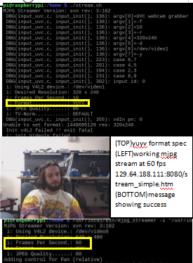

# Digital Window Project
Uses a Rasberry Pi to run a an intercom system with tweeting

### Overall Setup

​	To use, set up a [rasberry pi](https://www.raspberrypi.org/) with a [webcam](https://www.amazon.com/Logitech-Widescreen-Calling-Recording-Desktop/dp/B006JH8T3S)

​	If the pi is v3 or above, you can use wifi, otherwise you will need an adapter.
​	First, get your pi connected to the internet, [using its ip adress](https://www.raspberrypi.org/documentation/remote-access/ip-address.md)

## Tweeting
### Setup
​	Then, set up an app with [twitter](https://developer.twitter.com/) 

​	To set up the tweeting from the rasberry pi, [use this tutorial](		https://projects.raspberrypi.org/en/projects/getting-started-with-the-twitter-api/8)

​	My twitter.py script relies on there being an auth.py file with your twitter credentials
​		And also tweet with a button press

### Results

​	With the twitter.py script, you can generate tweets like this with a button press (see twitter.py file 

​		for more links)
​	

## Intercom
### Setup

​	Use [this tutorial](https://blog.cudmore.io/post/2015/03/15/Installing-mjpg-streamer-on-a-raspberry-pi/) to install the streaming equipment with your webcam

​	With this setup, the frame rate will be slow, increase it 

​		[with this command](https://sourceforge.net/p/mjpg-streamer/discussion/739917/thread/541a9b8c/)

### Results

With the results, you can run a stream that looks like this:

### Contributors

​	This project was implemented by Jacob Smith for [Brandeis University Makerlab](http://brandeismakerlab.com/) during the summer of 	2019

​	Please email makerlab@brandeis.edu if you would like to contribute to this project or install your own 	digital window